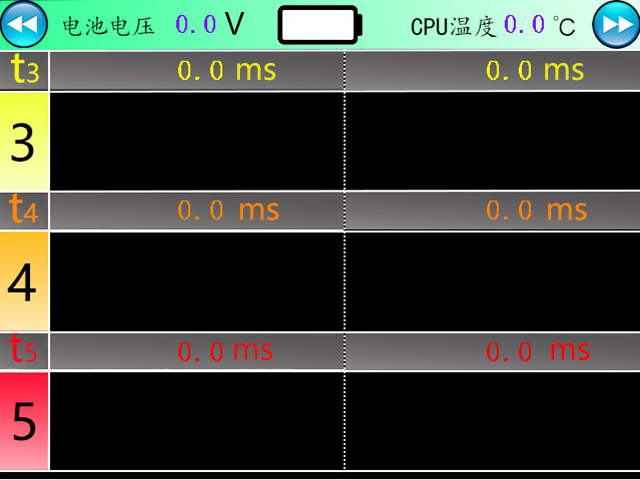
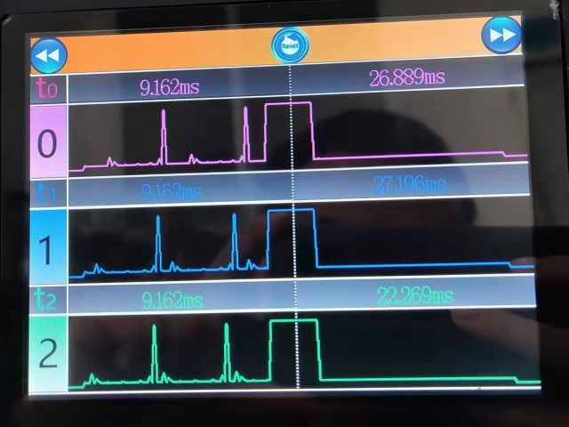
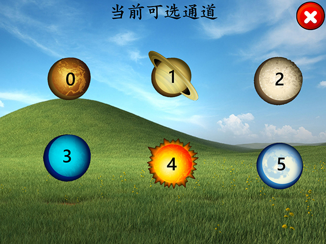
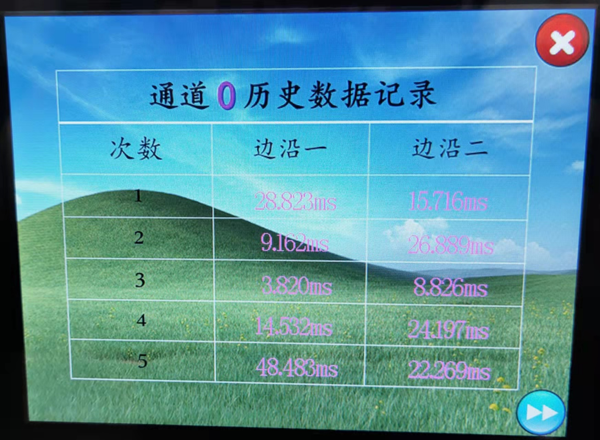

操作指南
============

开机/屏保界面
+++++++++++++

    
    图 5.1.1 开机/屏保界面

* 打开电源开关或者接入外部电源后，您将会看到此界面。这个界面将会作为开机时首次显示的主界面和屏保模式下界面。
  **注意，主机屏幕再无任何操作大约5min钟后进行熄屏以节省电量** ，此时您仅需要触模屏幕即可点亮。

前台界面
+++++++++++

    
    图 5.2.1 主界面1

* 此界面主要由类型操作按钮、两次测量时间以及两次测量波形三部分构成。
 
* 左边第一个按钮为 **返回上一页（开机/屏保界面）** ，您触摸它将会触发相应功能。
* 中间按钮为 **复位**，您触摸它将会触发相应功能。
* 最右边按钮为 **跳转到下一页（主界面二）** ，您触摸它将会触发相应功能。
  
.. figure:: ../source/picture/按钮1.bmp
    :align: left
    :alt: 后退按钮
    :scale: 100%

    后退按钮

    前进按钮

.. figure:: ../source/picture/按钮2.bmp
    :align: center
    :alt: 复位按钮
    :scale: 100%

    复位按钮

.. tip:: 
    * **复位按钮使用介绍** :
    * 1、如果您当前的测试需求是需要多通道/全六通道同时测量，但是当前通道0-5中 ``某一个/多个通道`` ,已经存在数据和波形，为了方便获得全新的界面，
      您可以使用 ``复位`` 按钮。
    * 2、另一种情况是：当前有各别通道已经产生了 ``异常、干扰、非同步通道使用`` 所造成的极少数通道彼此间数据波形出现不同步情况 ，也可以使用 ``复位`` 按钮来解决您的问题。

.. figure:: ../source/picture/12_界面12.jpg
    :align: center
    :alt: NULL
    :scale: 70%
    
    图 5.2.2 复位弹窗

.. tip:: 
    * 当您按下 ``sure`` 按钮后，所有通道的 ``前后台数据`` 将会被立即清除。

    
    图 5.2.3 主界面2

* 图 **5.2.1** 和图 **5.2.2** 共同构成高压断路器动特性检测仪的前台界面，通道按0-5顺序排列，唯一区别的的是，界面图 **5.2.1** 上有 ``复位`` 按钮，而界面图 **5.2.2** 没有。

.. figure:: ../source/picture/结果显示栏.bmp
    :align: center
    :alt: NULL
    :scale: 100%
    
    图 5.2.4 测量结果显示栏

.. note:: 
    * **测量结果显示栏说明** :
    * 最左边的 ``t0`` 表示的是当前栏目为通道0的测量结果，上图中①区域通常表示为断路器 ``闭合`` 时机械抖动时间,②区域通常表示为断路器 ``断开`` 时机械抖动时间。
      当然您也可以自由组合你所需要的测量方式的组合。
    * ①区域和②区域中测量所得到的时间单位固定为 ``ms``，数据整数为可表示为 ``9999.999ms``。

    
    图 5.2.5 波形显示栏

.. note:: 
    * **波形显示栏说明** :
    * 最左边 ``0`` 表示的是当前栏目为通道0的波形，中间的虚线将把每次测量所得到的波形分屏为区域①和区域②显示。
    * 您需要注意的是，每个半屏开始和结束的状态因该是一个 ``相反`` 的状态（比如开始状态是上升沿，则结束状态因该稳定为高电平）。
    * 波形的显示顺序总是从左到右，当区域①和区域②都存在波形显示时，下一次测量将会清除全部波形，回到区域①进行显示，依次循环。

    
    图 5.2.6 实测效果图

后台界面
+++++++++++

    
    图 5.3.1 所有通道历史记录选择页面

* **您通过触摸上图中相应通道标号，即可进入对应通道的历史记录界面**

.. figure:: ../source/picture/04_界面4.jpg
    :align: center
    :alt: NULL
    :scale: 70%
    
    图 5.3.2 通道0历史历史数据记录

* 上图显示的是通道 ``0`` 的后台历史数据，总共分为 ``5`` 组，每组包含 ``2`` 次测量的历史数据。
  

    
    图 5.3.3 实测效果图

    
    图 5.3.4 历史数据清除弹窗

.. note:: 
    * **历史数据清除弹窗说明** :
    * 当您连续测量次数超过 ``5`` 次时，此弹窗便会弹出，此时说面你的本次测量数据写入历史记录时，发现例如图 5.3.2中数据已经存满的情况。
    * 您按下 ``覆盖`` 按钮时，之前的历史数据并不会清除，而是从首次开始对后台历史数据产生覆盖。
    * 您按下 ``清除`` 按钮时，之前的历史数据会立即被清除，本次数据的历史记录将从头开始。