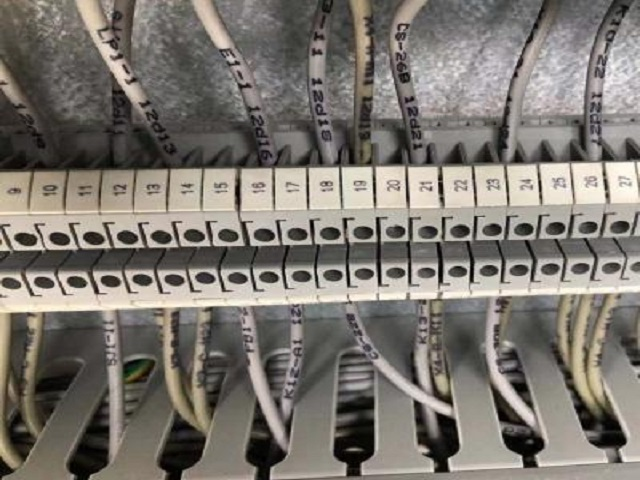
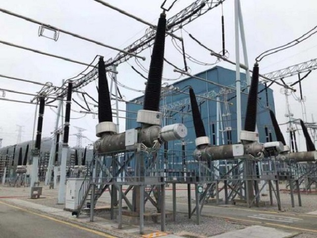

概述
==========

本产品为高压断路器动特性测试仪，公司遵循国家行业执行标准：``GB10963.1-2005``,确属本公司产品质量问题，自购置之日起保修期为3个月(非正常使用而致使产品损坏，烧坏的，不属保修之列)。

* 高压断路器是高低压电器回路中执行线路通断的执行机构，承担着线路合闸、分闸工作。断路器性能的好坏直接影响着输变电环节的安全生产过程，因此在各换流站大量使用的高压断路器需要保持持续有效的性能检测。
  然而，由于高压断路器安装位置高、使用数量多，在传统的生产检测环节，需要动用大型辅助升降设备协助操作人员进行断路器检测信号线的接驳和断开，不仅生产效率低下，而且存在高危、高风险、工作量巨大、协同人员多的诸多缺点。为了降低换流站检修人员工作风险，实现在限定时间站内所有高压断路器的检测工作，本项目拟设计一款高压断路器快速分合闸检测装置，将操作人员从多人员协同、重复线路接驳、操作繁琐的检测工作中解放出来，实现线路一次接驳重复测试，单人操作快速检测断路器特性的复杂测试过程。
  低压断路器是现代控制中广泛使用的线路分断执行机构，在生产现场的控制柜内大量使用了不同线圈电压、不同触点耐压和电流容量的低压接触器，此类接触器虽然功率较小，但是承担着监测、控制线路中信号传递的作用，如果各关键控制信号在控制系统和现场检测仪表之间传输时，由于接触器性能下降导致的误触发或抖动，都会导致控制系统判断失误，引起错误的执行结果，甚至引起控制失败。在实际应用中，由于控制回路或信号传输回路异常导致的系统误动作频繁发生，不仅造成生产成本增加，甚至可能由于错误的动作导致巨大损失。

* 因此，无论高压断路器还是低压断路器，其 ``机械、电气`` 特性的优良直接影响着生产安全和控制安全。由于所有接触器一旦接入现场使用就无法全部拆下检测，其工作特性和参数检测均需在现场进行。在传统的检测过程中，由于缺乏专用的检测手段和检测工具，工作人员往往需要付出巨大的劳动时间、人员数量和时间成本才能完成所有甚至部分现场断路器的特性检测。然而由于检测手段和检测设备导致的测试结果异常也屡屡发生，反复的测试验证工作更是加重了测试工作的劳动强度并延长了测试时间。对于需要在限定时间内按时完成检修任务的现场检测工作，对所有现场测试人员都是一个巨大的考验。 

    图 1.1 低压断路器控制回路

    图 1.2 高压断路器控制回路

    